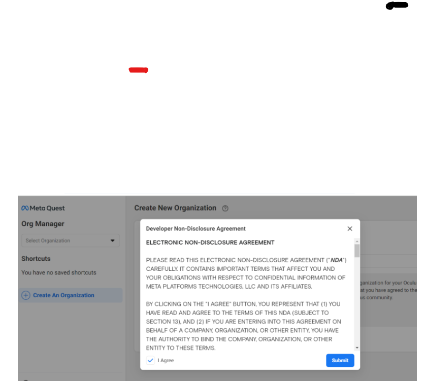

# Putting Your Meta Quest into Developer Mode  
---

 

 
 

---

## 1 Search: Meta quest developer  
 
---
 
 

* Search: Meta Quest Developer.  
* Then Click on "Create a Developer Account. 
 
 

## 2 Click Sign Up

---
 
---
 

* Click on the Blue Sign up Box. 
   
   

## 3 Create a Meta account

---
 
---
 

* Create a Meta account if you do not have one  
* If you have a Meta account already log into it. 

 

   
   

## 4 Create a New Organization

---
 
---
 

* You will need to select create an organization.  
* Choose a name, this can be anything that you'd like including your own name, as long as it is available. 
 
* Click the agree check box and submit. 
   
   

## 5 Double Authentication

---
 
---
 

* Choose the Verification Option  
* This will open up two options to authenticate your account. 
* Choose the "Two-Factor" method by "Phone Number". 
  * Not saying you can't do the other but the phone number is quicker. 
     
     

## Turning on Developer Mode Via your Meta Phone App

---
 
---
 

* Open your Meta Quest mobile App. 
* Select The menu in the lower right corner. 
   
   
---
 
---
 

* Select "Device". 
   
   
---
 
---
 

* Choose Your Headset. 
  * The SN, which can be found in very small print on the left strap arm, will be after the word connected. 
     
     
---
 
---
 

* Select Headset Settings. 
   
   
---
 
---
The Menu should look like about. 

* Choose Developer Mode here. 
   
   
---
 
---
 

* Click the Debug Mode toggle so that it is to the right and appears blue. 
   
   

---
## YOU ARE NOW ROCKING IN DEVELOPER MODE!  

---
>Next: [SideQuest and Sideload](SideQL/SideQL.md)