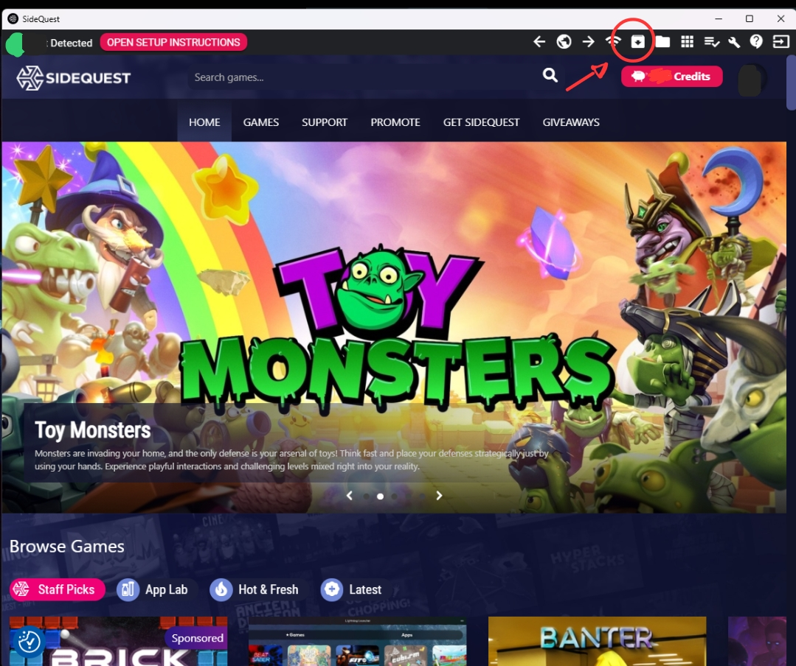
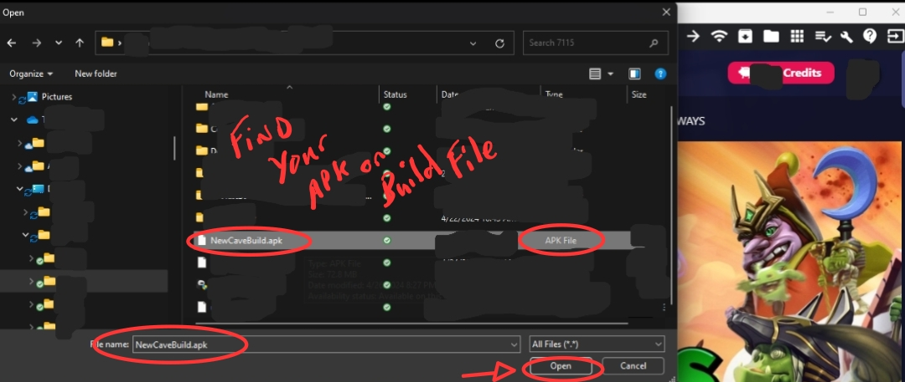
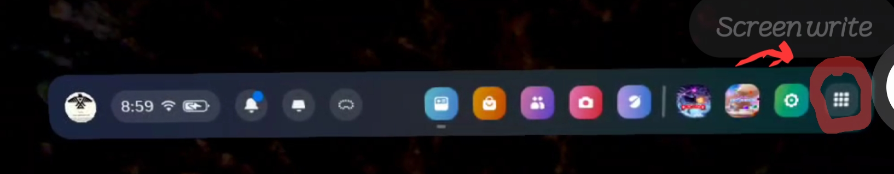
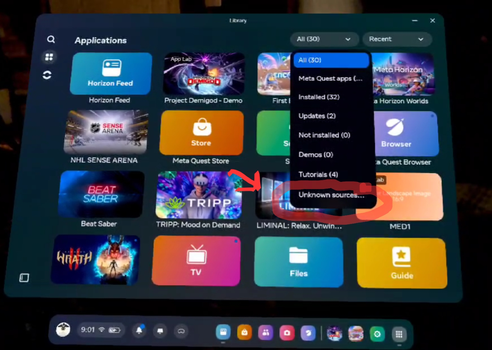
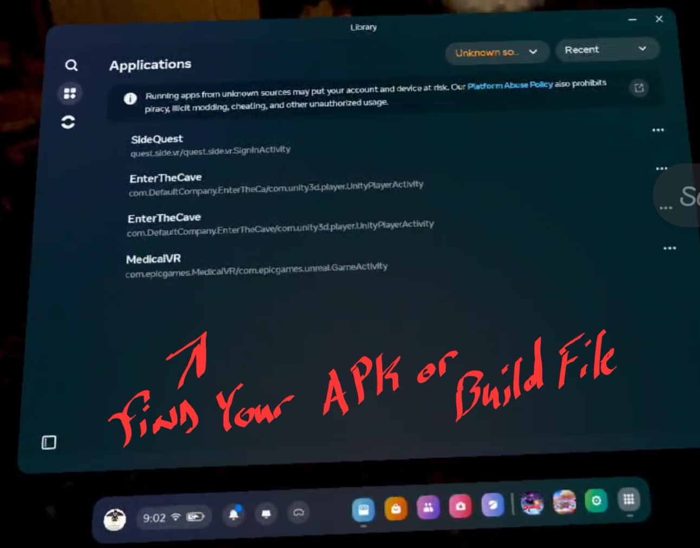

# Getting Started With SideQuest 
---
 
 
 
---

## Search SideQuest

---
 
 
* Download SideQuest onto your computer
  * Here is the link if you can't find it: https://sidequestvr.com/download
  * Choose the installer for your computer
  * Install SideQuest  
   

---
## Open SideQuest on Your Computer and Connect Headset

---
 
* Open SideQuest App on your Computer 

---

 
 
* Click on the "Open Setup Instructions" Button, the above screen will open. 
* In the Photo above you can see that the headset is not connected. 
* Must often it is because your headset is not connected 
  * Plug in your headset using your c to c charging cord.  
   
  * Allow the Debug prompt in your Headset. 
    
---

* This should change all four of your connection status lights to Green.  
 

* Now you are ready to upload your APK to your headset. 

---

 

## Uploading your APK/Build and Find it in your Meta Quest 3 Headset.

---
 
 
 

* Go back to the home screen. 
* You should now see a green circle in the upper left hand corner. 
* Click on the square with the downward  arrow on that is circled on the top right side of the screen.  
  * This will open the file explorer for you to find your APK/Build File. 
 
  
* Locate your APK File  
  * Selected your APK  
  * Press Open  
 

---
## Finding your APK in your Meta Quest 3

---
### Inside your Meta Quest Headset
 
On Your Menu Bar 
 

* On the Right side click on the "Library Menu" 
---
 
From there, select the drop down menu that is shown below.

* Go down to the bottom of that drop down menu and select the Unknown Sources. 
  * If it is not an option, restart your Meta Quest Headset and repeat the "Inside your Meta Quest Headset" 
---
 
 

  * Now you should be able to find you Build.
    * Keep in mind that the name is the name on the build and may not match up with the name on your APK file.
