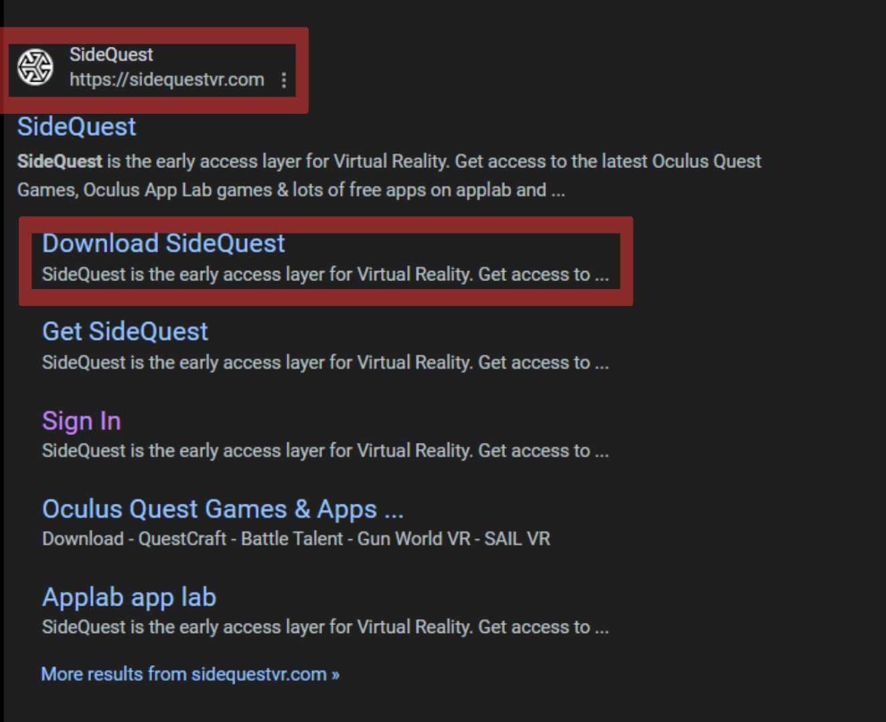
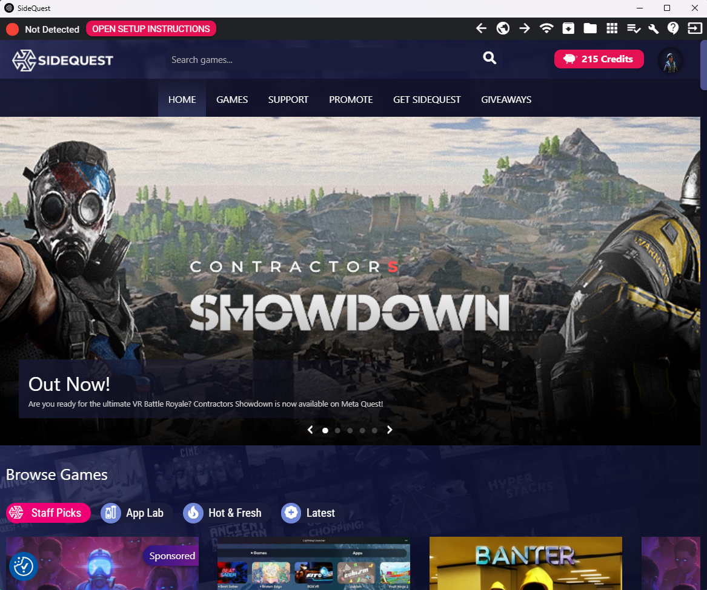
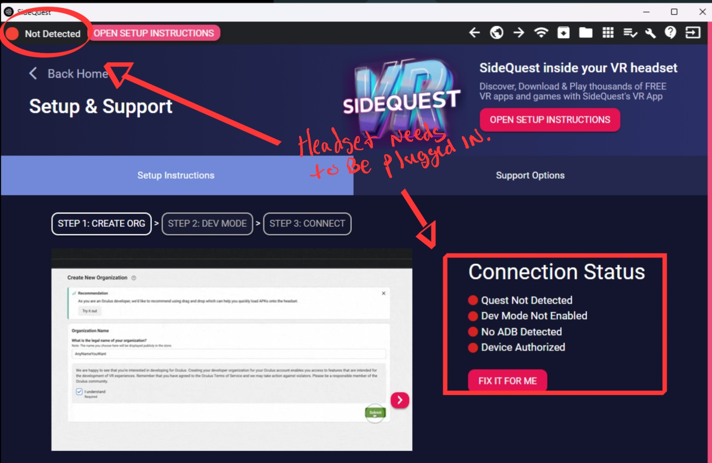
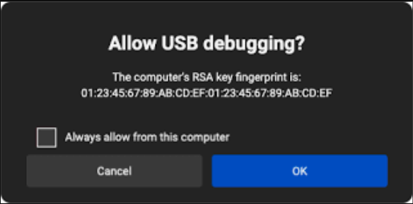
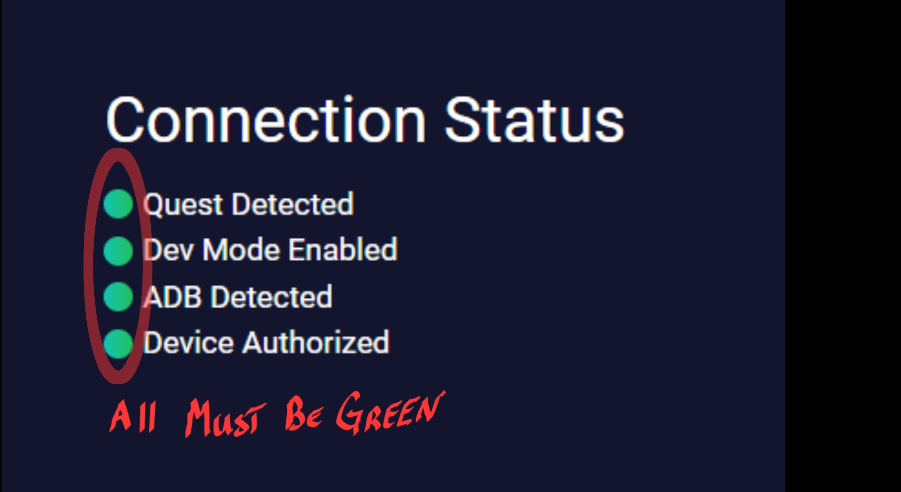

# Getting Started With SideQuest 
---
 
 
 
---

## Search SideQuest

---
 
 
* Download SideQuest onto your computer
  * Here is the link if you can't find it: https://sidequestvr.com/download
  * Choose the installer for your computer.
  * Install SideQuest

---
## Open SideQuest on Your Computer and Connect Headset

---
 
 
* Open SideQuest App on your Computer
---
 
 
* Click on the "Open Setup Instructions" Button, the above screen will open. 
* In the Photo above you can see that the headset is not connected. 
* Must often it is because your headset is not connected 
  * Plug in your headset using your c to c charging cord. 
 
  
    * Allow the Debug prompt in your Headset. 
   
---

 

* This should change all four of your connection status lights to Green. 
 
 
 
---
## Uploading your APK/Build and Find it in your Meta Quest 3 Headset.

---

