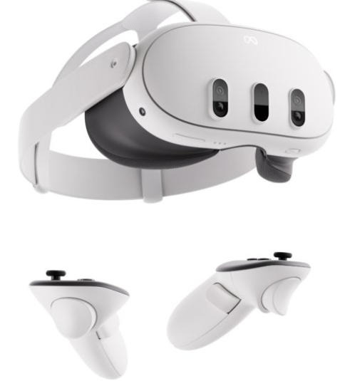
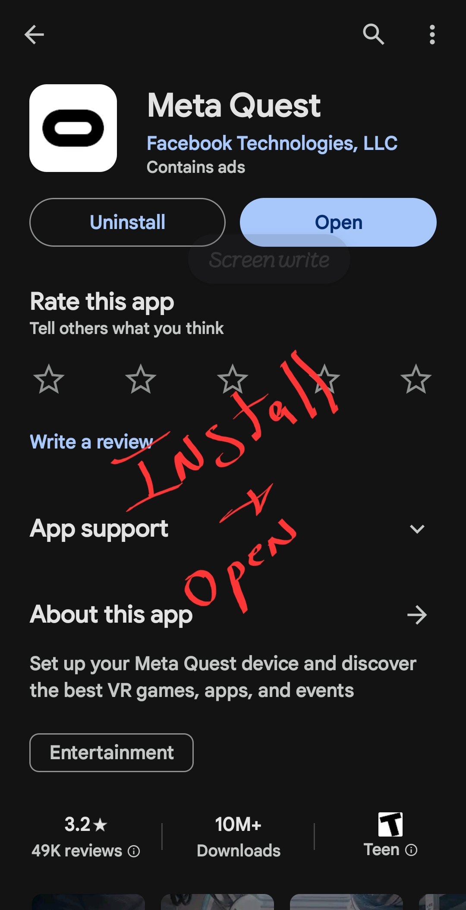
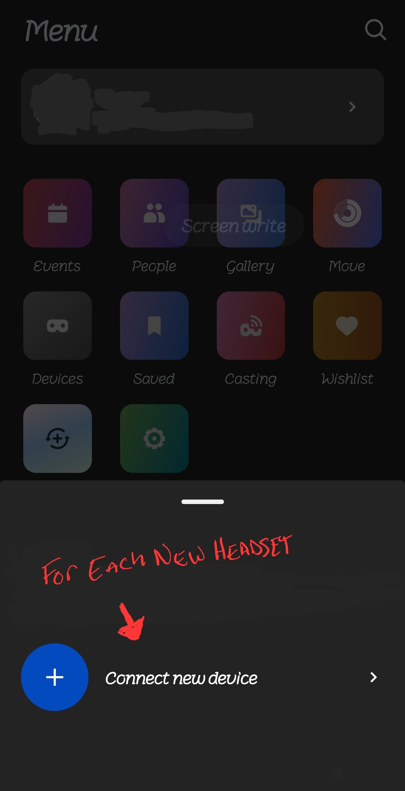
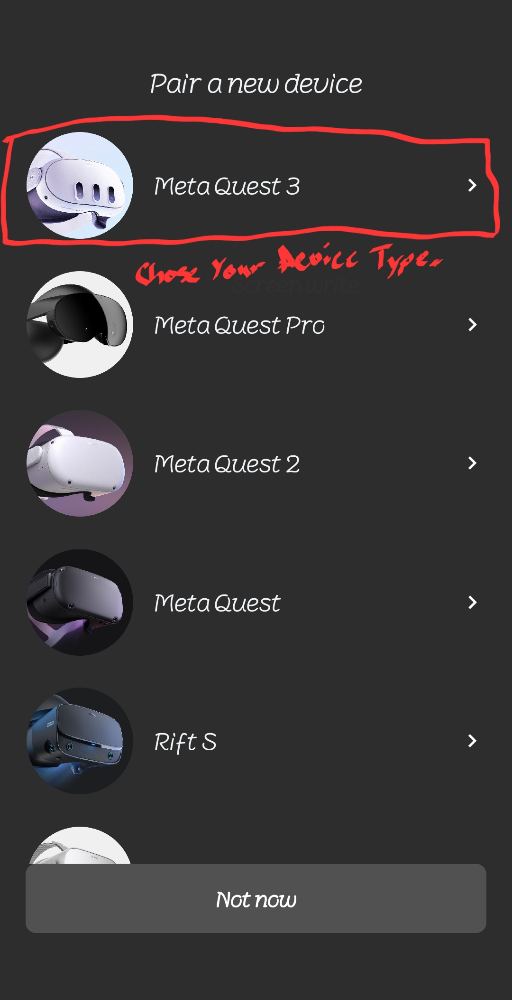
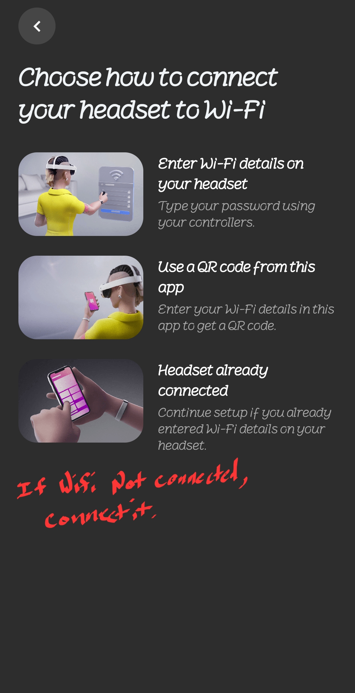
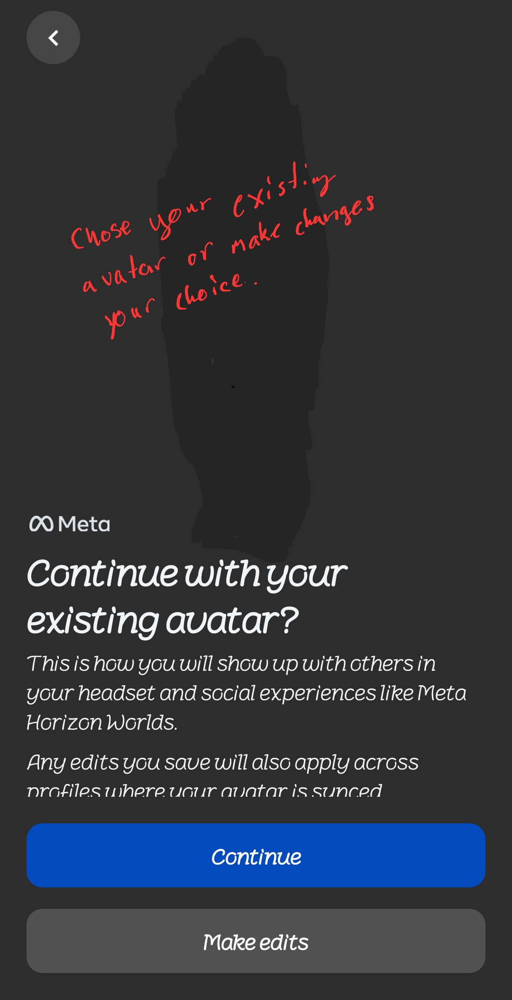
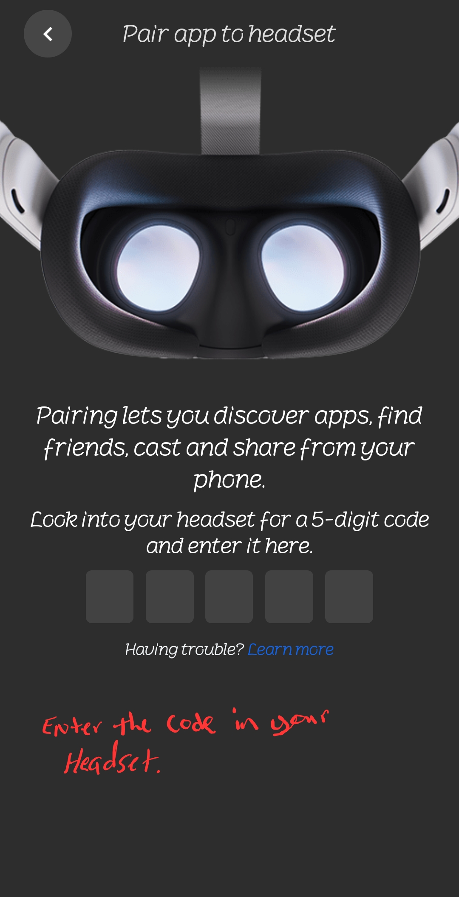

# Setting up your Meta Quest 3  
---

 

 
 

---

## Download The Meta App  
 
---

 

* You will want to download the Meta App from the apple play store or google play store. 
* After opening and signing in to the app, make sure your headset is powered up.  

 

## Connecting Your Headset to Your Meta App
---
 
---
 

* In the lower right hand corner select "Menu".  
* Then press the Devices Square.  
* Choose Connect new device, if it is a new headset or chose your headset if it it is not currently paired.
 
 

## Select Your Device

---
 
---
 

* Choose Your device, which should be the Meta Quest 3.  
 
 

## Wifi

---
 
---
 

* Make sure your headset is connected to the same wifi that your device is connected to.  
* If you do not have wifi in the area a hotspot will work but it will be more difficult. 
   
   

## Avatar

---
 
---
 

* This step is not that important.  
   
   

## Final Step

---
 
---
 

* The app will prompt you to enter a pin.  
* Look in your Meta Quest headset and there should be a five digit pin. 
* Once the pin is entered your Meta App should be connected to your Meta Quest 3 Headset. 
   
   

---
## Yay!  
Now you can move on to putting it into Developer Mode.

---
>Next: [Developer Mode](DevMode/DevMode.md)